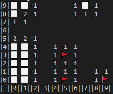

# Minesweeper
Minesweeper built in rust using [iced.rs](https://iced.rs/)

## Running
Clone the repository and run the executable.

Left click to open a field, right click to flag a field.

Click the face to start a new game or change difficulty.

## Self-solving features
This application features a self-solving mode where the game can play itself.

Holding the `alt` key will show the solvers predictions of the chance a field contains a mine, these are used during the self playing feature.

Pressing `enter` will have the self-solver perform a single action (e.g. open a field, or flag a field).
Holding the enter key down will allow the self-solver to repeatedly execute actions.
