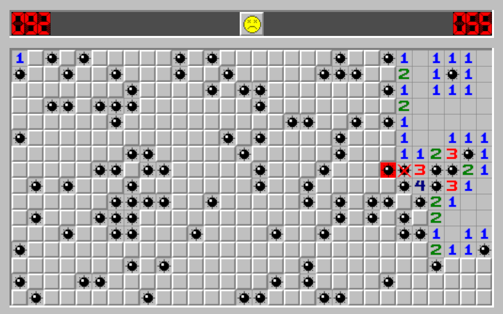

# Minesweeper
Basic command line minesweeper built using rust.



Simple project to teach myself the basics of rust.

## Help
```
Simple cli minesweeper

USAGE:
    minesweeper <MINES> [ARGS]

ARGS:
    <MINES>     
    <WIDTH>     [default: 10]
    <HEIGHT>    [default: 10]

OPTIONS:
    -h, --help       Print help information
    -V, --version    Print version information
```

## Running
With cargo installed, use:
```
cargo run 10
```
to start a game with a 10x10 grid containing 10 mines.

To view additional arguments, use:
```
cargo run -- --help
```

## Gameplay
While playing, you can enter `help` to view commands:

```bash
// Opens the field with the given coordinates
o <x> <y>

// Flags the field with the given coordinates
f <x> <y>
```
